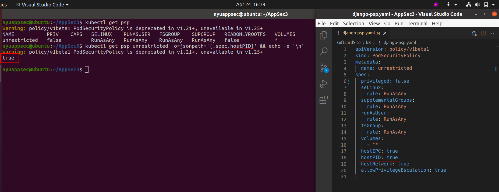
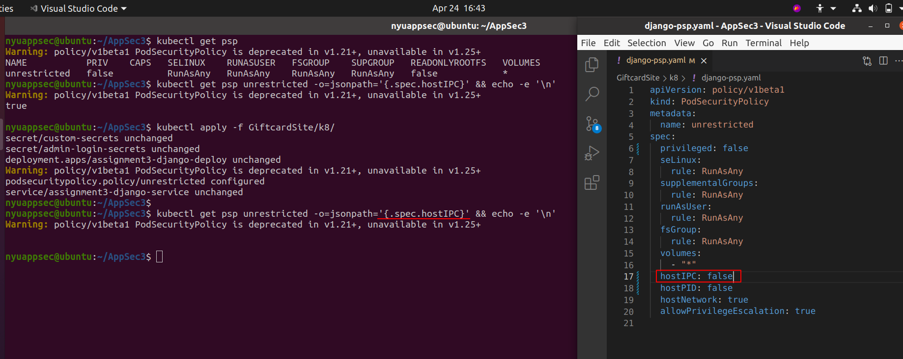
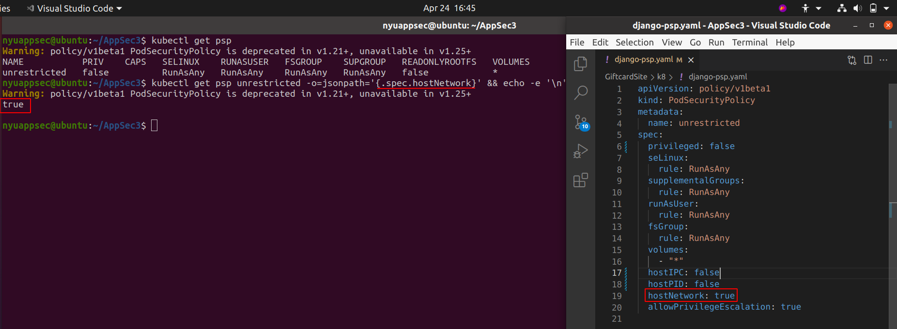
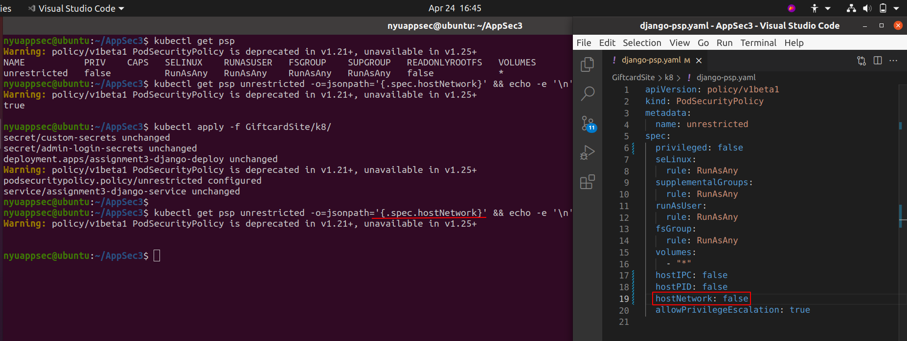
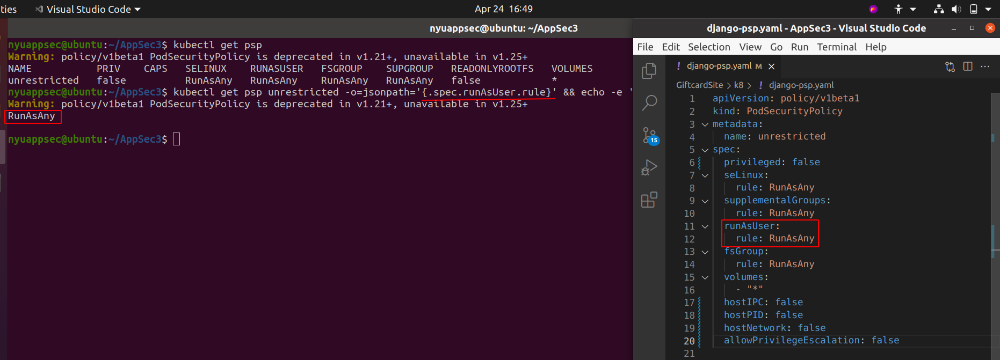
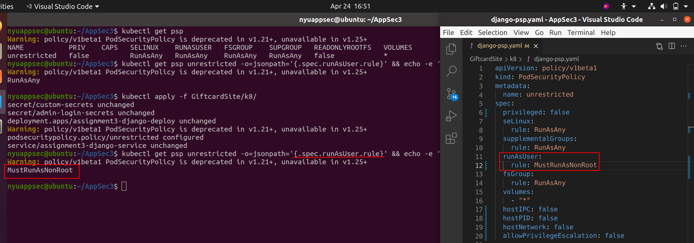
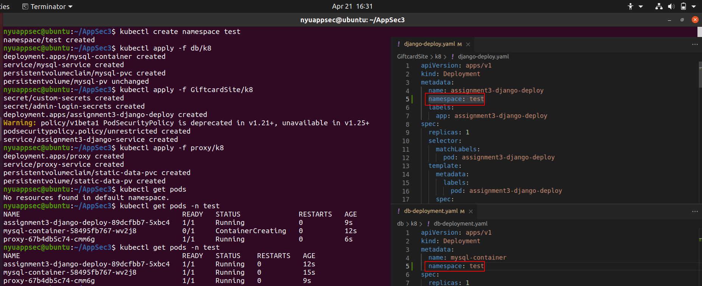
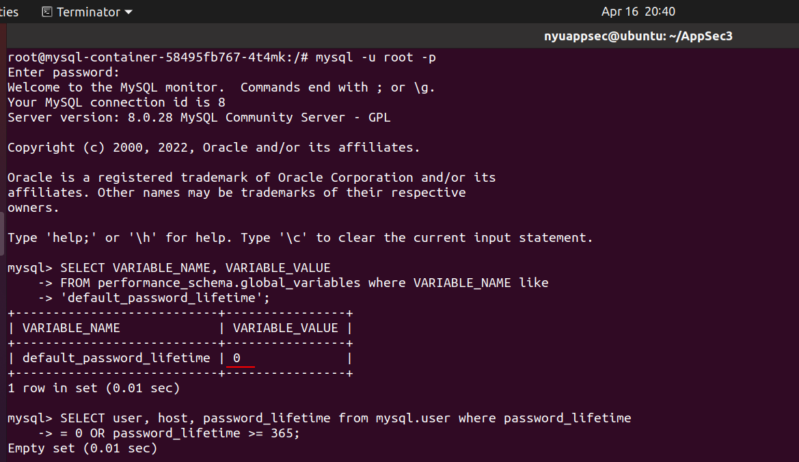
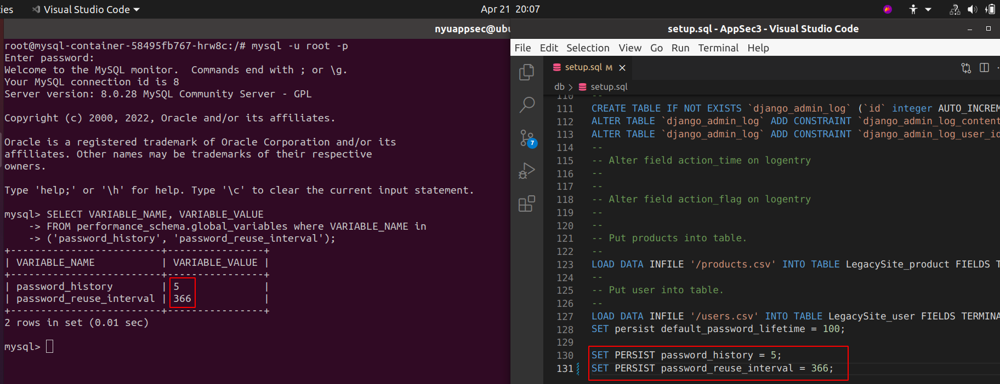

# Part 1: Remediate Security Review Findings

## Finding 1: Kubernetes Control #5.2.1
---
We can see that the when we run `kubectl get psp` to view the security policy, our container is running with full privileges which should not be allowed because then the container will be allowed to do almost everything the host can do. Additionally, in the image below when we run the command mentioned in the benchmark file to get the value for `spec.privileged` field from the psp we can see that it returns **true**.

In order to remediate the finding, we open the `django-psp.yaml` file in the GiftcardSite/k8 folder and change the privileged field from true to false. Upon applying the changes we can see that command now shows no output which means that there our container is not running with full privileges.

## Finding 2: Kubernetes Control #5.2.2
---
Here, we have found that our container shares the host process ID namespace and it should not be allowed because this can assist in escalating privileges outside of the container. When we run the command in the benchmark to fetch for `spec.hostPID` value from the psp we can see that the output is **true**.

In order to remediate the finding, we edit the psp file and change the hostPID field from true to false. Upon applying the changes we can see that our command no longer shows an output of true which means we there is not container that shares the host process ID namespace and we have successfully remediated the finding.

## Finding 3: Kubernetes Control #5.2.3
---
Here, we have found that our container shares the host IPC namespace and this should not be allowed because this it can be used to interact with processes outside of the container. On running the command in the benchmark to fetch the value for `spec.hostIPC` from the psp, it gives an output of **true**.

In order to remediate the finding, we edit the hostIPC field in the psp and change it to false. Upon applying the changes that our command no longer gives an output which indicates that we have successfully remediated the findings.

## Finding 4: Kubernetes Control #5.2.4
---
We have found that our container shares the host network namespace and it should not be allowed because this can be used to access network traffic to and from other pods. On running the command in the benchmark to fetch the value for `spec.hostNetwork` we can see that it outputs a value **true**.

In order to remediate the finding, we change the hostNetwork field in the psp to false. On applying the changes we can see that our command no longer gives an output which indicates that we have successfully remediated the finding.

## Finding 5: Kubernetes Control #5.2.5
---
We have found that our container runs with allow privilege escalation flag set to true. This should not be allowed because this can allow the container to gain more privileges than the parent. On running the command in the benchmark to fetch the value for `spec.allowPrivilegeEscalation` we can see that it outputs a value **true**.

In order to remediate the finding, we change the allowPrivilegeEscalation field in the psp to false. On applying the changes we can see that our command no longer gives an output which indicates that we have successfully remediated the finding.

## Finding 6: Kubernetes Control #5.2.6
---
We have found that our container is allowed to run as root and it should not be allowed because this can be used to break out of the container. On running the command in the benchmark to fetch the value for `spec.runAsUser.rule` we can see that it outputs a value **RunAsAny** which indicates that it is allowed to run as root.

In order to remediate the finding, we change the runAsUser field in the psp and set the rule to `MustRunAsNonRoot`. On applying the changes we can see that our command gives an output value of MustNotRunAsRoot which indicates that we have successfully remediated the finding.

## Finding 7: Kubernetes Control #5.2.7
---
We have found that our container is running with NET_RAW capability and it should not be allowed because this capability can be misused by an attacker to create further damage if he has gained access to the pod or any other connected pod. On running the command in the benchmark to fetch the value for `spec.requiredDropCapabilities` we can see that it does not output anything. This means that the pod is not dropping any capabilities.

In order to remediate the finding, we change add requiredDropCapabilities field in the psp and set its value to NET_RAW. On applying the changes we can see that our command gives an output of \["NET_RAW"\] which indicates that we have successfully remediated the finding.

## Finding 8: Kubernetes Control #5.4.1
---
In this finding we can see in the image below that our pod uses sensitive values like secret key and the database password that is stored directly inside the settings.py and the deployment file in plaintext.

In order to remediate this, we first create our own kubernetes secret file and store the new values for secret key and the database password in them. These values are base64 encoded.

We then make changes to our deployment file such that it fetches our base64 encoded values from the custom-secrets file that we created and stores them as environment variable in the pods.

We also make changes to settings.py file so that our application fetches secret key and the database password from the environment variables. After applying the changes, when we get a shell on the pod we can see that the environment variables now have values that we had created and stored in the custom-secrets file.

On apply all the deployments again, we can see that our site is still running as expected.

## Finding 9: Kubernetes Control #5.7.1
---
We have found that currently there are no namespaces implemented in our deployment. We have to create a namespace so that resources in one namespace are hidden from another namespace which can help reduce the impact in case of an attack. When we run `kubectl get namespaces` we can see that we only have the default namespace.

In order to remediate the finding we first create a namespace and make changes to all the yaml files in our Appsec3 folder. Under the metadata we add the namespace field with the value of test which is the namespace we created. We then apply the configurations and check if the pods run.
In the image below we can see that our pods are running successfully.

Now when we run `kubectl get namespaces` we can see our test namespace also exists. On running `minikube service list` we can see that our test namespace is up and running. Hence we have successfully remediated the finding.

## Finding 10: Kubernetes Control #5.7.2
---
We have found that Seccomp is disabled in our cluster. This should not be done because Seccomp restricts the system calls applications make thus allowing administrator a greater control over the security of workload.
We can see in the below image that our deployment files do not have the securitycontext set.

In order to remediate the finding we add the following lines to all three of our deployment files

> `securityContext:`  
&nbsp;&nbsp;&nbsp;&nbsp;&nbsp;`seccompProfile:`  
&nbsp;&nbsp;&nbsp;&nbsp;&nbsp;&nbsp;&nbsp;&nbsp;&nbsp;&nbsp;`type: RuntimeDefault`

After making the above changes and applying them we can see that no errors were thrown and we have successfully applied the changes.

## Finding 11: Docker Control #4.1
---
We have found that our Giftcardsite container and the proxy container are running as root. When we run the command from the benchmark to fetch the UID of the containers we can see that the containers are running with the UID of 0 which means root.

In order to remediate the finding, we edit the the Dockerfile for Giftcardsite and proxy to add a new user and then we switch to that user. In the image below we can see that when we run the command to fetch the UID of the containers we can see that the UID has now changed to 100. Also when we get shell inside the container and run `whoami` we can see that the container is running as the user that we created in the Dockerfile.

## Finding 12: Docker Control #4.2
---
This finding remediated because the dockerfile is already built off of a high trust base image.

## Finding 13: Docker Control #4.3
---
Here, we have found that there are unnecessary packages installed on our container. This should not be done because they only increase the attack surface. We can check for all the installed packages using the command `apk info` inside the docker container. We can see the output in the image below.

In order to remediate the finding, we comment out the lines that install the unnecessary packages and rebuild the docker image. We can see that our image was successfully built with no errors.

We can also see that our website is still working as expected.

## Finding 14: Docker Control #4.9
---
We have found that our Dockerfile uses the command ADD in order to copy files from local host to the container. This is dangerous because the ADD command can also be used to fetch files from remote URLs.

In order to mitigate the finding, we use the COPY command instead of add. This command can only copy files and hence cannot be used to fetch malicious files from a remote server.

After replacing the ADD command with COPY and rebuilding the Dockerfiles we can see that our application is still functioning as expected.

## Finding 15: Docker Control #4.10
---
We can see that the Dockerfile inside the db folder uses stored password for the database. This should not be done because the passwords are in plaintext and storing them inside dockerfiles is not a good practice.

In order to remediate the finding:
- We comment out the line that stores the password from the Dockerfile.
- Use the custom-secret file created previously
- Change the db-deployment.yaml file to read secret from the custom-secret file and store is as environment variable.

Below image demonstrates the entire process.

After rebuilding the Docker image and applying changes to the deployment file we can see that our mysql pod is running and it has now the sql password from our custom-secrets file.

## Finding 16: MySQL Control 1.2
---
This finding is a pass because we are already using least privileged account to run the MYSQL Service.

## Finding 17: MySQL Control #2.3
---
This finding is a pass because we already have a dedicated machine running for MYSQL.

## Finding 18: MySQL Control #2.7
---
We have found that the password never expires. This should not happen because users should have to change their password periodically. On running the command in the benchmark we can see that the default_password_lifetime is 0. This means that the password never expires.

In order to remediate the finding, we edit the `setup.sql` file and set the default_password_lifetime to 100. This means the the password will expire after 100 days. On rebuilding the image and running the benchmark command again we can see that the changes have been applied successfully.

## Finding 19: MySQL Control #2.9
---
We have found that there are no policies defined to disable password reuse and ensure strong password policy. When we run the command in the benchmark we get the below output. Both values of 0 mean that there are no rules.

In order to remediate the finding, we edit the `setup.sql` file and set the password_history to 5 and password_reuse_interval to 366. On rebuilding the image and running the benchmark command again we can see that the changes have been applied successfully.

## Finding 19: MySQL Control #4.2
---
This finding states that we should not have any test/example databases on our container. On running the command in the benchmark, we can see that we only have our production db running and no other databases. Hence we have already passed this control.

# Part 2
In order to automate the findings and make them run periodically we use kubernetes CronJob. A cronjob is a task the can run itself after predefined intervals. The cronjob will create a new pod every time it will run. 

In the CronJob configuration, we add the database to the pod along with the database password from our custom-secret file. We then mount an executable bash file into the pod which contains the command that will check for the controls. The mounted file is created used kubernetes configmap. This is used to create a file from the commands mentioned inside of it. We then simply run the mounted bash file and get the output from the controls. In the image below we can see our configmap file and the CronJob file.

We then apply the configmap and the cronjob using kubectl. The CronJob checks for MySQL control #2.7 and #2.9. It will not only display the output of the command in the benchmark but all the result whether the test passed or failed depending upon the output.

In the image below we can see that the CronJob created a new pod. Upon completion we can check its logs to see the output. Here we can see that it shows that password lifetime control has passed because its value is 100 but it did not pass the password reuse policy because it is not greater than or equal to 365.

When we change the password reuse interval to 366 in the setup.sql file and rebuild the images and rerun the CronJob we can see that it outputs that the control was passed.

